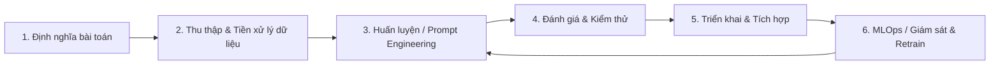

# Báo cáo Nghiên cứu: Workflow AI Chuẩn & Các Repository Nổi Bật

Báo cáo này được tạo tự động bởi skill `/nothing:nothing` nhằm tổng hợp các thông tin nghiên cứu về quy trình phát triển tác nhân trí tuệ nhân tạo (AI Agent Software Development Lifecycle) và các repository GitHub hàng đầu hiện nay.

---

## 1. Quy trình Phát triển Phần mềm AI Chuẩn (AI SDLC)

Quy trình phát triển phần mềm có tích hợp AI hoặc xây dựng AI Agent có sự khác biệt so với SDLC truyền thống nhờ tính **lặp lại liên tục (iterative)** và **phi tất định (non-deterministic)**. Một workflow AI chuẩn thường gồm 6 giai đoạn:

1. **Khám phá & Xác định yêu cầu (Explore & Define)**: Làm rõ các trường hợp sử dụng, KPIs đo lường (như độ chính xác, tốc độ đáp ứng, chi phí token).
2. **Chuẩn bị Dữ liệu (Data Preparation)**: Thu thập dữ liệu sạch, xây dựng tài liệu làm ngữ cảnh cho RAG (Retrieval-Augmented Generation) hoặc tinh chỉnh (Fine-tuning).
3. **Thiết kế & Huấn luyện (Build & Prompt Chaining)**: Lựa chọn mô hình cơ bản (LLMs) và thiết lập các kịch bản tương tác (như Agentic workflow, Prompt chaining, multi-agent).
4. **Kiểm thử (Evaluation & Test)**: Sử dụng các bộ test để đánh giá ngoại tuyến (Offline Evaluation) và thử nghiệm thực tế nhằm phát hiện lỗi ảo tưởng (hallucination).
5. **Triển khai (Deploy)**: Tích hợp vào hệ thống qua API, thiết lập cơ chế kiểm soát an toàn (Human-in-the-loop) đối với các tác vụ nhạy cảm.
6. **Bảo trì & Giám sát (Observe & Maintain)**: MLOps theo dõi sự trôi dạt dữ liệu (data drift) và phản hồi từ người dùng để điều chỉnh prompt hoặc tinh chỉnh mô hình.

---

## 2. Top GitHub Repositories cho AI Agent Workflows nổi bật nhất (2025/2026)

Dưới đây là các dự án mã nguồn mở có số lượng sao (star) và mức độ tương tác cao nhất trên GitHub hỗ trợ xây dựng workflow AI:

| Repository | Ngôn ngữ | Số Stars | Mô tả & Điểm nổi bật |
| :--- | :--- | :--- | :--- |
| **[langflow-ai/langflow](https://github.com/langflow-ai/langflow)** | Python | ~149k | Công cụ trực quan cực mạnh giúp kéo thả và thiết kế các AI agent, chuỗi prompt và RAG workflows một cách nhanh chóng. |
| **[langgenius/dify](https://github.com/langgenius/dify)** | TypeScript | ~143k | Nền tảng phát triển ứng dụng LLM toàn diện (LLMOps). Hỗ trợ xây dựng giao diện kéo thả, quản lý RAG và tích hợp Agent APIs. |
| **[HKUDS/nanobot](https://github.com/HKUDS/nanobot)** | Python | ~43.5k | Agent AI gọn nhẹ hỗ trợ tích hợp công cụ, chat và thiết lập các workflow tự động. |
| **[openai/openai-agents-python](https://github.com/openai/openai-agents-python)** | Python | ~26.8k | Framework chính thức từ OpenAI giúp xây dựng các multi-agent workflow một cách nhẹ nhàng và hiệu quả. |
| **[activepieces/activepieces](https://github.com/activepieces/activepieces)** | TypeScript | ~22.5k | Hệ thống tự động hóa workflow hỗ trợ tích hợp AI Agent và hơn 400 máy chủ MCP (Model Context Protocol). |
| **[Arindam200/awesome-ai-apps](https://github.com/Arindam200/awesome-ai-apps)** | Python | ~12.6k | Thư viện tổng hợp các ứng dụng AI thực tế bao gồm RAG, multi-agent và các ca sử dụng tiêu biểu. |
| **[alibaba/spring-ai-alibaba](https://github.com/alibaba/spring-ai-alibaba)** | Java | ~9.8k | Dự án của Alibaba hỗ trợ lập trình viên Java xây dựng ứng dụng Agentic AI trên nền Spring Framework. |
| **[julep-ai/julep](https://github.com/julep-ai/julep)** | Jupyter | ~6.6k | Nền tảng serverless hỗ trợ triển khai các workflow AI có trạng thái (stateful) ở quy mô lớn. |
| **[awslabs/aidlc-workflows](https://github.com/awslabs/aidlc-workflows)** | Python | ~2.6k | Hệ thống luật điều phối vòng đời phát triển định hướng AI (AI-DLC) dành cho các coding agent của AWS. |
| **[vercel/workflow](https://github.com/vercel/workflow)** | TypeScript | ~2.1k | SDK của Vercel giúp lập trình viên Node.js xây dựng các ứng dụng và tác nhân AI có tính quan sát và độ bền cao. |

---

## 3. Các Nguyên tắc Vàng khi Thiết kế AI Agent Workflow
* **Tư duy Modular hóa (Modular Design)**: Chia nhỏ agent thành các phần nhỏ thực hiện nhiệm vụ đơn nhất (Single-responsibility). Tránh xây dựng các "monolithic agents" đa năng nhưng kém ổn định.
* **Tích hợp Human-in-the-Loop (HITL)**: Bắt buộc dừng để con người xác nhận trước các tác vụ nguy hiểm như xóa dữ liệu, gửi email hoặc giao dịch tài chính.
* **Chuẩn hóa công cụ qua Model Context Protocol (MCP)**: Giúp các agent dễ dàng kết nối đến dữ liệu và công cụ ngoại vi một cách an toàn và nhất quán.
